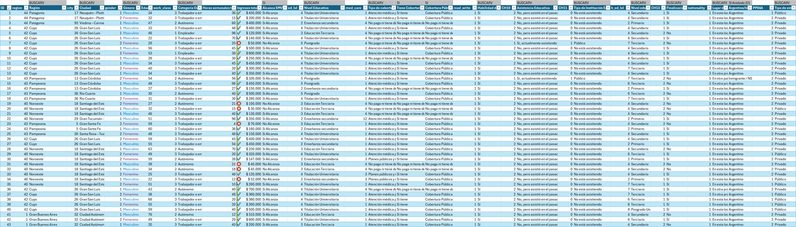
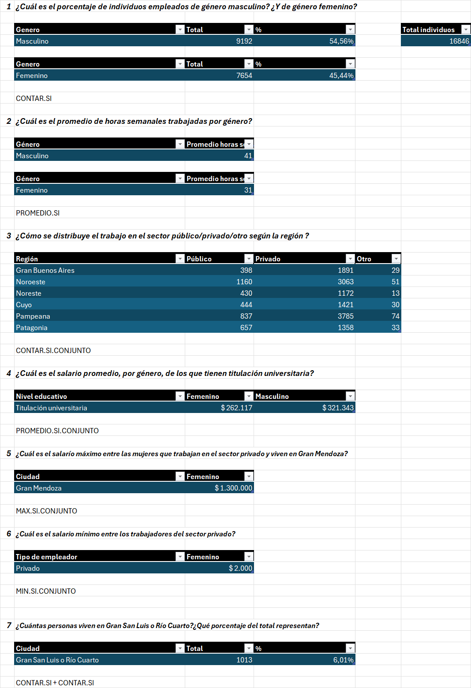
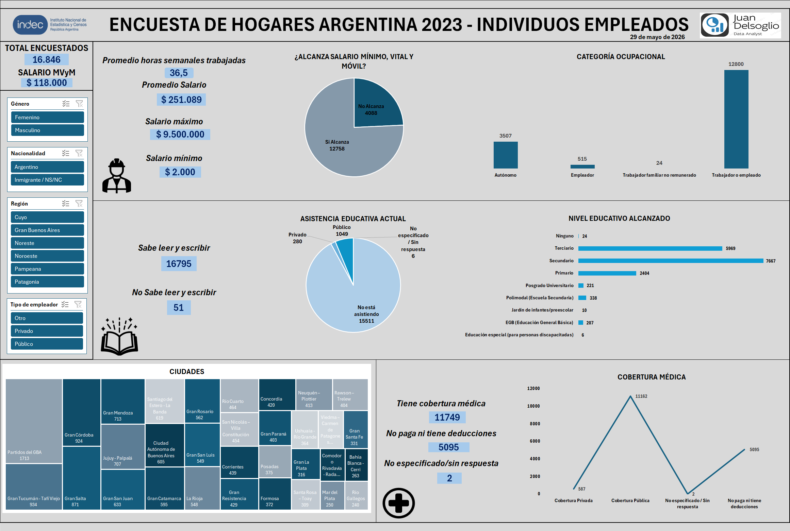

# Argentina Household Survey 2023 - Excel Data Cleaning & Dashboard

## Project Description
This project focuses on transforming a raw government dataset from INDEC (Argentina) containing over 16,000 records into an analysis-ready structure and creating an interactive dashboard. The objective was to clean the data, analyze demographic and socio-economic patterns, and build a visual tool to answer key business and labor questions.

---

## Data Cleaning & Transformation
Cleaned a 16,000+ row raw CSV dataset. Key actions included:
* Translating column encodings and technical names into readable variables.
* Adding a unique ID field for consistency.
* Applying data validation rules and conditional formatting to detect outliers.
* Implementing functions like `VLOOKUP`, `COUNTIF`, `AVERAGEIF`, and conditional logic.

### Cleaned Dataset Preview:

---

## Pivot Table & Business Analytics
Developed deep-dive pivot tables to systematically answer 7 core business and demographic questions regarding:
* Gender distribution and average hours worked.
* Regional employment breakdowns (Public vs. Private sectors).
* Income metrics, including minimum, maximum, and average salaries filtered by education and region (e.g., Gran Mendoza, Gran San Luis, Río Cuarto).

### Business Questions & Analytical Breakdown:

---

## Interactive Dashboard
Built a dynamic dashboard featuring interactive charts and slicers for quick filtering by region, gender, education level, and employment type to ensure data insights are clear and actionable for decision-making.

### Dashboard Preview:

---

## Repository Contents
* `Argentina_Household_Survey_2023.xlsx`: The complete Excel file containing raw data, clean data tables, pivot analysis formulas, and the final dashboard.
* `cleaned_dataset.jpg`: Preview of the data cleaning process.
* `business_questions.png`: Breakdown of the 7 business analytics metrics.
* `dashboard_preview.png`: Main view of the interactive dashboard.

## Source Dataset
Data obtained from INDEC Argentina public records (Household Survey 2023).
